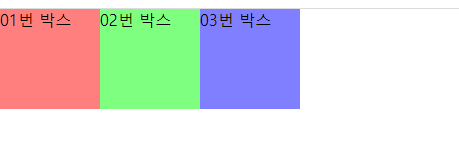
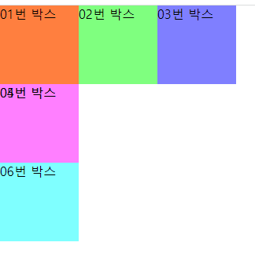
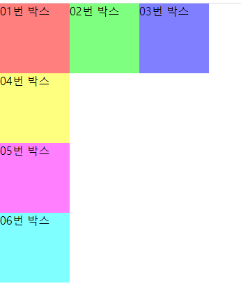
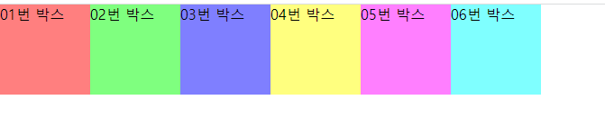
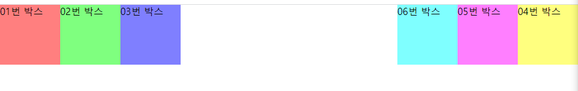
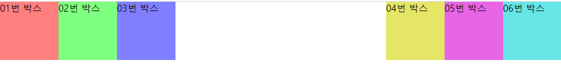

# float, flex  
[1. float속성](#1-float속성)  
[-- 1.1 float 속성](#11-float-속성)  
[-- 1.2 clear 속성](#12-clear-속성)  
[-- 1.3 float 예시](#13-float-예시)  
[2. flex](#2-flex)  
[-- 2.1 CSS Flex : 부모요소에 display: flex; 속성 적용, 자식요소의 위치(배치)를 지정](#21-css-flex--부모요소에-display-flex-속성-적용-자식요소의-위치배치를-지정)  
[-- 2.2 flex-wrap : 자식요소의 줄바꿈 여부 설정](#22-flex-wrap--자식요소의-줄바꿈-여부-설정)  
[-- 2.3 flex-flow: flex-direction flex-wrap; 두 개 속성 띄어쓰기로 구분, 함께 작성](#23-flex-flow-flex-direction-flex-wrap-두-개-속성-띄어쓰기로-구분-함께-작성)  
[-- 2.4 justify-content: 플렉스 요소 간 정렬 방법](#24-justify-content-플렉스-요소-간-정렬-방법)  
[-- 2.5 align-items: 교차축 기준 배치 방법(요소끼리의 배치)](#25-align-items-교차축-기준-배치-방법요소끼리의-배치)  
[-- 2.6 align-content : 여러줄일 때 교차축 기준 정렬](#26-align-content--여러줄일-때-교차축-기준-정렬)  

# 1. float속성

## 1.1 float 속성

- 이미지와 텍스트들을 어떻게 배치할 건 지에 대해 정의하기 위해 존재
- 요소가 어떻게 떠야 하는지를 지정
- float: left  
: 왼쪽에 배치 ⇒ 이미지 - 왼쪽, 텍스트 - 이미지를 감싸면서 배치
- float: right  
: 오른쪽에 배치
- float: none  
: 레이아웃 정렬X
- initial  
: 기본값으로 초기화 상태
- inherit  
: 상위 태그의 정렬 속성을 상속받아서 정렬시킴

## 1.2 clear 속성

- float 해제하는 속성
- left, right, both (보통 both 많이 씀)

---

## 1.3 float 예시

`div 박스`는 **block 속성을 가지고**, **세로로 쌓이면서 정렬되는 게 기본**입니다. 이 **div박스를 가로로 정렬하고 싶을 때 float:left; 속성을 사용**합니다.

```css
#box01 {background-color: rgba(255, 0, 0, .5); float: left;}
#box02 {background-color: rgba(0, 255, 0, .5); float: left;}
#box03 {background-color: rgba(0, 0, 255, .5);float: left;}
```



float속성이 적용된 요소의 다음에 따라오는 요소에 영향을 끼쳐 그 뒤에 오는 요소가 밑으로 깔려 들어간다

```css
#box01 {background-color: rgba(255, 0, 0, .5); float: left;}
#box02 {background-color: rgba(0, 255, 0, .5); float: left;}
#box03 {background-color: rgba(0, 0, 255, .5);float: left;}

#box04 {background-color: rgba(255, 255, 0, .5);}
#box05 {background-color: rgba(255, 0, 255, .5);}
#box06 {background-color: rgba(0, 255, 255, .5);}
```



float속성을 적용할 때 주의할점  
**float속성이 적용된 요소**의 다음에 **따라오는 요소(깔린 요소)**에 영향을 끼쳐 그 뒤에 오는 요소가 밑으로 깔려 들어가기 때문에 **해당 요소에 clear:both; 속성을 이용해 float 속성을 해제**합니다.

```css
#box01 {background-color: rgba(255, 0, 0, .5); float: left;}
#box02 {background-color: rgba(0, 255, 0, .5); float: left;}
#box03 {background-color: rgba(0, 0, 255, .5);float: left;}

#box04 {background-color: rgba(255, 255, 0, .5); clear: both;}
#box05 {background-color: rgba(255, 0, 255, .5);}
#box06 {background-color: rgba(0, 255, 255, .5);}
```

  

box01~06까지 왼쪽부터 가로로 정렬

```css
#box01 {background-color: rgba(255, 0, 0, .5); float: left;}
#box02 {background-color: rgba(0, 255, 0, .5); float: left;}
#box03 {background-color: rgba(0, 0, 255, .5);float: left;}

#box04 {background-color: rgba(255, 255, 0, .5); float: left;}
#box05 {background-color: rgba(255, 0, 255, .5); float: left;}
#box06 {background-color: rgba(0, 255, 255, .5); float: left;}
```

  

flaot: right 하면 순서가 오른쪽부터 붙는다  
float: right; 속성은 화면 우측의 박스를 가로로 정렬할 수 있지만 순서가 뒤바뀝니다.(오른쪽부터 순서대로 붙기 때문)

```css
#box01 {background-color: rgba(255, 0, 0, .5); float: left;}
#box02 {background-color: rgba(0, 255, 0, .5); float: left;}
#box03 {background-color: rgba(0, 0, 255, .5); float: left;}

#box04 {background-color: rgba(255, 255, 0, .5); float: right;}
#box05 {background-color: rgba(255, 0, 255, .5); float: right;}
#box06 {background-color: rgba(0, 255, 255, .5); float: right;}
```

  

묶어주는 부모 박스 안에서 float해준다  
박스를 우측에 붙이되 순서를 지키고 싶을 경우,  
전체를 감싸는 부모박스(컨테이너 역할)를 하나 더 만들어 float:right; 시킨 다음 그 안에 들어가는 요소들에 float:left; 를 해주면 됩니다.(컨테이너 안에서 또다시 가로로 정렬)

```css
#box01 {background-color: rgba(255, 0, 0, .5); float: left;}
#box02 {background-color: rgba(0, 255, 0, .5); float: left;}
#box03 {background-color: rgba(0, 0, 255, .5); float: left;}

#right_container {width: 300px; height: 100px; background-color: rgba(0, 0, 0, .2); float: right;}
#box04 {background-color: rgba(255, 255, 0, .5); float: left;}
#box05 {background-color: rgba(255, 0, 255, .5); float: left;}
#box06 {background-color: rgba(0, 255, 255, .5); float: left;}

<body>
    <div id="box01">01번 박스</div>
    <div id="box02">02번 박스</div>
    <div id="box03">03번 박스</div>

    <div id="right_container">
        <div id="box04">04번 박스</div>
        <div id="box05">05번 박스</div>
        <div id="box06">06번 박스</div>
    </div>  
</body>
```



# 2. flex

## 2.1 CSS Flex : 부모요소에 display: flex; 속성 적용, 자식요소의 위치(배치)를 지정

### flex-direction : 자식 요소의 축과 방향을 설정

### flex-direction: row; 가로 방향, 왼쪽>오른쪽으로 정렬(기본값)

### flex-direction: row-reverse; 가로 방향, 오른쪽>왼쪽으로 정렬

### flex-direction: column; 세로 방향, 위>아래로 정렬

### flex-direction: column-reverse; 세로 방향, 아래>위로 정렬

---

## 2.2 flex-wrap : 자식요소의 줄바꿈 여부 설정

### flex-wrap: nowrap; 줄바꿈 없이 한 줄에 표시.(기본값) 넘치면 부모의 width 무시

### flex-wrap: wrap; 줄바꿈해서 표시. 부모요소에 높이가 지정되어 있는 경우 기본적으로 높잇값을 꽉채우고, 줄바꿈시 균등하게 나눠들어간다.

### flex-wrap: wrap-reverse; 줄바꿈해서 표시. 부모요소에 높이가 지정되어 있는 경우 기본적으로 높잇값을 꽉채우고, 줄바꿈시 균등하게 나눠들어간다. 행 순서 반대로

---

## 2.3 flex-flow: flex-direction flex-wrap; 두 개 속성 띄어쓰기로 구분, 함께 작성

### flex-flow: row wrap; 가로방향 왼>오, 넘치면 줄바꿈

### flex-flow: colum nowrap; 세로방향 위>아래, 줄바꿈X

---

## 2.4 justify-content: 플렉스 요소 간 정렬 방법

### justify-content: flex-start; 주축 시작점(기본값)

### justify-content: flex-end; 주축 끝점

### justify-content: center; 중앙 정렬

### justify-content: space-between; 양쪽 정렬

### justify-content: space-around; 균등 정렬(양끝에도 공간 있음)

---

## 2.5 align-items: 교차축 기준 배치 방법(요소끼리의 배치)

### align-items: flex-start; 교차축 시작점 기준

### align-items: flex-start; 교차축 끝점 기준

### align-items: center; 교차축 가운데 기준

### align-items: baseline; 문자 기준선(g 같은 경우 꼬리가 아래로 내려가 있음)

### align-items: stretch; 늘려서 채움

### + align-self 속성

---

## 2.6 align-content : 여러줄일 때 교차축 기준 정렬

### align-content : flex-start; 교차축의 시작점에 맞춰 배치

### align-content : flex-end; 교차축의 끝점에 맞춰 배치

### align-content : center; 교차축의 가운데에 맞춰 배치

### align-content : space-between; 교차축 기준 양쪽 정렬

### align-content : space-around; 교차축 기준 균등 간격

### align-content : stretch; 교차축 기준 늘려 채움