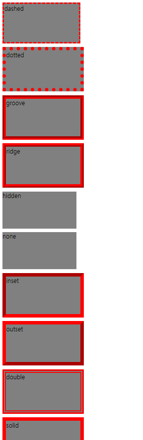
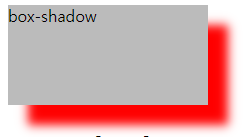
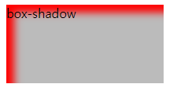
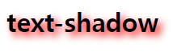

# stroke_shadow

# 테두리와 그림자

### border 테두리

- 요소 테두리의 스타일, 너비 및 색상을 지정할 수 있습니다.
- `border : border-width border-style border-color;`
- 순서 상관 X 세개 다 입력  
border-width : 테두리 두께  
border-style : 테두리 모양  
border-color : 테두리 색상
- margin, padding과 동일하게 값의 개수에 따라 방향 결정  
만약 각각 적으려면 사이에 방향을 작성  
ex: border-left-width 이런식으로
- `dashed`
    - 점선 테두리를 정의합니다.
- `dotted`
    - 점선 테두리를 정의합니다.
- `groove`
    - 3D 홈 테두리를 정의합니다.  
    효과는 테두리 색상 값에 따라 다릅니다.
- `ridge`
    - 3D 융기된 테두리를 정의합니다.  
    효과는 테두리 색상 값에 따라 다릅니다.
- `hidden`
    - 숨겨진 테두리를 정의합니다. none과 같으나 테이블 셀요소에 적용하는 경우 테두리를 통합합니다.
- `none`
    - 경계를 정의하지 않음. 테두리를 없앰. border-width 값이 설정이 되어있더라도 style이 none이면 0으로 만든 것과 같다. (기본값)
- `inset`
    - 3D 삽입 테두리를 정의합니다.  
    효과는 테두리 색상 값에 따라 다릅니다.
- `outset`
    - 3D 아웃셋 테두리를 정의합니다.  
    효과는 테두리 색상 값에 따라 다릅니다.
- `double`
    - 이중 테두리 정의
- `solid`
    - 단색 테두리를 정의합니다.
- 각 style의 예시 이미지



- 각방향 묶어서 표현

```css
#box11 {
    /* 방향별로 묶어서 표현 */
    /* border-top: 10px solid yellow;
    border-right: 10px dotted green;
    border-bottom: 10px double blue;
    border-left: 10px dashed magenta; */

    /* 속성별로 묶어서 표현 */
    border-width: 10px 15px 20px 25px;
    border-style: solid dotted double dashed;
    border-color: yellow green blue magenta;

    /* 속성 값의 개수에 따른 방향 */
    /* border-width: 5px 10px; (상하 5px, 좌우 10px)
    border-width: 5px 10px 20px; (상 5px, 좌우 10px, 하20px)
    border-width: 상 우 하 좌;
    마진이나 패딩과 같이 들어가는 위치 동일 */
    
    /* border: 두께 모양 색상;
    순서는 상관X, 세가지 다 설정되어야 함.
    각 방향마다 따로 설정 가능
    ex) border-top: 1px solid yellow;
    border-bottom-width: 2px; */
}
```

- 귀도리

px로 넣었을 때랑 %로 넣었을 때 원형의 모양이 바뀐다.  

```css
#box12 {
    /* border-radius: 10px 30px; */
    /* border-radius: 0 0 50% 50%; */
    border-radius: 0 0 150px 150px;
}
```

### CSS로 모양 만들기

> **transparent** : 투명도
> 

[**[출처] CSS로 모양 만들기**](https://css-tricks.com/the-shapes-of-css/)  

- 네모

```css
/* 네모 */
#box13 {
  width: 0px; height: 0px;
  border-top: 20px red solid;
  border-bottom: 20px solid blue;
  border-right: 20px solid green;
  border-left: 20px solid yellow;
}
```

- 반으로 잘림

```css
/* 반으로 잘림 */
#box13 {
  width: 0px; height: 0px;
  /* border-top: 20px red solid; */
  border-bottom: 20px solid blue;
  border-right: 20px solid green;
  border-left: 20px solid yellow;
}
```

- 세모

```css
/* 세모 */
#box13 {
  width: 0px; height: 0px;
  /* border-top: 20px solid red; */
  border-right: 20px solid transparent;
  border-bottom: 20px solid green;
  border-left: 20px solid transparent;
  background-color: white;
}
```

---

### box-shadow속성

첫번째 숫자 : X축의 이동거리. 양수는 오른쪽, 음수는 왼쪽  
두번째 숫자 : Y축의 이동거리. 양수는 아래쪽, 음수는 위쪽  
세번째 숫자 : 흐림도(값이 커질 수록 흐려짐. 흐려지는 정도. 생략 가능. 생략하면 0과 같다.)  
네번째 숫자 : 번짐도(그림자의 번지는 정도. 그림자 자체의 크기. 양수는 사방으로 크기가 커지고, 음수는 사방으로 축소. 기본값은 0, 생략 가능)  
색상 : 그림자 색상 지정(보통 rgba로 많이 사용)  
inset : 안쪽 그림자(텍스트는 X)  

```css
#box14 {box-shadow: 20px 20px 10px 0px red;}
```




```css
#box14 {box-shadow: 20px 20px 10px -10px red inset;}
```




---

- text-shadow

```css
h1 {text-shadow: 10px 5px 10px red;}
```



