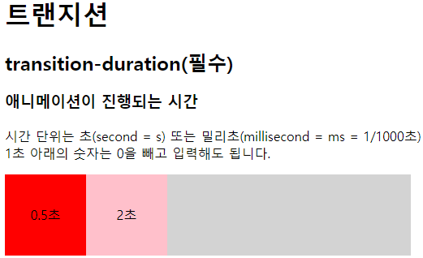
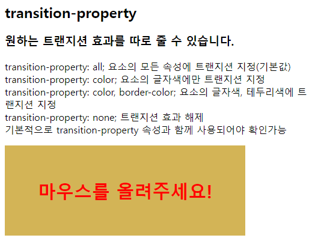
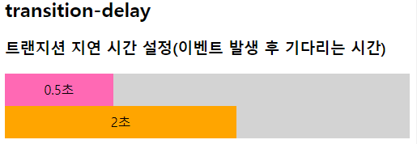
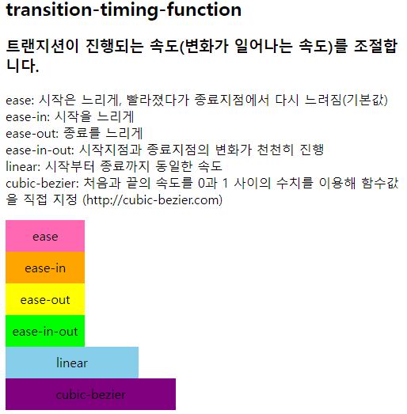
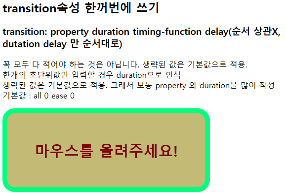

# transition

# 트랜지션

## transition-duration(필수)

### 애니메이션이 진행되는 시간

- 시간 단위는 초(second = s) 또는 밀리초(millisecond = ms = 1/1000초)  
1초 아래의 숫자는 0을 빼고 입력해도 됩니다.

```css
.container01 {
    width: 500px; height: 100px; background-color: lightgray;
}
.box01 {
    width: 100px; height: 100px;
    text-align: center; line-height: 100px;
    float: left;
}
.box01:hover {background: orange;}
.duration_05{
    background: red;
    transition-duration: .5s;
}
.duration_2{
    background: pink;
    transition-duration: 2s;
}
```




## transition-property

### 원하는 트랜지션 효과를 따로 줄 수 있습니다.

- **transition-property: all;**  
요소의 모든 속성에 트랜지션 지정(기본값)
- **transition-property: color;**  
요소의 글자색에만 트랜지션 지정
- **transition-property: none;**  
트랜지션 효과 적용하지 않음  
기본적으로 transition-property 속성과 함께 사용되어야 확인가능
- **transition은 :hover에 적용시키는 게 아니다**

```css
.property {
    width: 400px; height: 150px; background: skyblue; font-size: 30px; text-align: center; line-height: 150px; font-weight: bold; 
    transition-duration: 4s; transition-property: background-color;
}
.property:hover {background: orange; color: red;}
```




## transition-delay

### 트랜지션 지연 시간 설정(이벤트 발생 후 기다리는 시간)

```css
.container02 {
    width: 500px; height: 80px; background-color: lightgray;
}
.box02 {
    width: 100px; height: 40px; text-align: center; line-height: 40px; 
    transition-duration: 2s;
}
.box02:hover {width: 500px;}
.delay_05 {
	background-color: hotpink; 
	transition-delay: .5s;
}
.delay_2 {
	background-color: orange; 
	transition-delay: 2s;
}
```




## transition-timing-function

### 트랜지션이 진행되는 속도(변화가 일어나는 속도)를 조절합니다.

- **ease**: 시작은 느리게, 빨라졌다가 종료지점에서 다시 느려짐(기본값)
- **ease-in**: 시작을 느리게
- **ease-out**: 종료를 느리게
- **ease-in-out**: 시작지점과 종료지점의 변화가 천천히 진행
- **linear**: 시작부터 종료까지 동일한 속도
- **cubic-bezier**: 처음과 끝의 속도를 0과 1 사이의 수치를 이용해 함수값을 직접 지정  
([http://cubic-bezier.com](http://cubic-bezier.com))

```css
.box03 {
	width: 100px; height: 40px; text-align: center; line-height: 40px; 
	transition-duration: 4s;
}
.box03:hover {width: 500px;}
.ease {
	background-color: hotpink; 
	transition-timing-function: ease;
}
.ease-in {
	background-color: orange; 
	transition-timing-function: ease-in;
}
.ease-out {
	background-color: yellow; 
	transition-timing-function: ease-out;
}
.ease-in-out {
	background-color: skyblue; 
	transition-timing-function: ease-in-out;
}
.linear {
	background-color: lime; 
	transition-timing-function: linear;
}
.cubic-bezier {
	background-color: tomato; 
	transition-timing-function: cubic-bezier(.21,.64,.87,.67);
}
```




## transition속성 한꺼번에 쓰기

### **transition: property duration timing-function delay** (순서 상관X, dutation delay 만 순서대로)

- 꼭 모두 다 적어야 하는 것은 아닙니다. 생략된 값은 기본값으로 적용  
한개의 초단위값만 입력할 경우 duration으로 인식  
생략된 값은 기본값으로 적용. 그래서 보통 property 와 duration을 많이 작성
- 기본값 : all 0 ease 0

```css
.transition {
	width: 400px; height: 150px; background: skyblue; font-size: 30px; text-align: center; line-height: 150px; font-weight: bold; border: 10px solid lime; 
	transition: all 2s ease-out 1s;
}
.transition:hover {background-color: orange; color: red; border-color: cyan; border-radius: 50px;}
```


