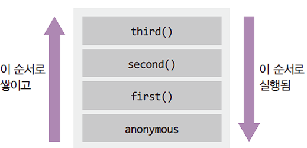
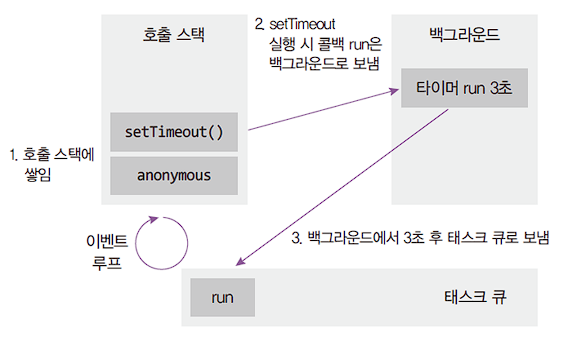
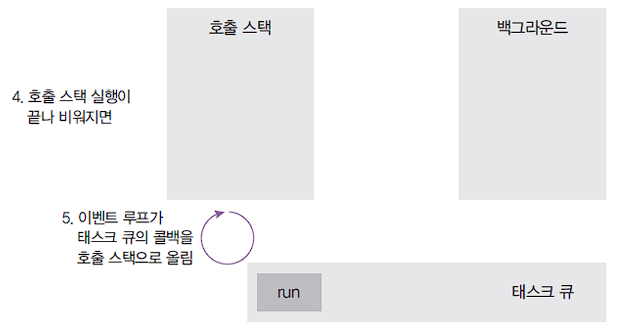

# Node.js  
[1.1 Node.js 란?](#11-nodejs-란)  
[1.2 Node.js 특성](#12-nodejs-특성)  
[-- 1.2.1 이벤트 기반](#121-이벤트-기반)  
[-- 1.2.2 논블로킹(Non-blocking) I/O](#122-논블로킹non-blocking-io)  
[-- 1.2.3 프로세스 vs 스레드](#123-프로세스-vs-스레드)  
[-- 1.2.4 싱글 스레드](#124-싱글-스레드)  
[2. 호출스택, 이벤트 루프](#2-호출스택-이벤트-루프)  
[-- 2.1 호출스택(함수의 호출, 자료구조의 스택)](#21-호출스택함수의-호출-자료구조의-스택)  
[-- 2.2 이벤트 루프](#22-이벤트-루프)  

# 1.1 Node.js 란?

구글 크롬의 js해석 엔진(V8)으로 이루어져 있다.  

js를 브라우저 외 다른 환경에서도 실행할 수 있게 해줌

js 실행창, 실행환경 

# 1.2 Node.js 특성

- Event-driven(이벤트 기반), Non-blocking I/O 특성을 가지는 실행 환경
- SNS, 채팅 서비스처럼 요청이 한번에 매우 많이 일어나는 서비스에 적합하다.
- JS로 웹서버 개발 가능
- 코드가 짧고 쉬워서 빠른 개발 가능 ⇒ 개발 생산성 향상

## 1.2.1 이벤트 기반

이벤트가 발생할 때 미리 지정해둔 작업을 수행하는 방식

- 이벤트의 예: 클릭, 네트워크 요청, 타이머 등
- 이벤트 리스너: 이벤트를 등록하는 함수
- 콜백 함수: 이벤트가 발생했을 때 실행될 함수

## 1.2.2 논블로킹(Non-blocking) I/O  

논 블로킹 : 오래 걸리는 함수를 백그라운드로 보내서 다음 코드가 먼저 실행되게 하고, 나중에 오래 걸리는 함수를 실행  
- 논 블로킹 방식 하에서 일부 코드는 백그라운드에서 병렬로 실행  
- 일부 코드: I/O 작업(파일 시스템 접근, 네트워크 요청), 압축, 암호화 등  
- 나머지 코드는 블로킹 방식으로 실행됨  
- I/O 작업이 많을 때 노드 활용성이 극대화  

### 영화 예매 서버의 처리 단계
1. 고객 요청
2. 요청 승낙후 처리
3. 티켓 고객에게 보내줌
- **일반 프로그래밍 언어로 서버 개발시**  
요청을 하나씩 받는다.  
요청이 많거나 오래 걸리는 요청이 있으면 그것을 처리하기 위해 다른 사용자의 요청을 못 받는다. (멈추거나 대기시간 발생)
- **node.js로 서버 개발시**  
요청을 한번에 받는다.  
처리속도가 빠른 것 순서로 요청을 처리한다.  그렇기 때문에 요청 받는 것을 멈추지 않는다.  (멈추거나 대기시간X)
- 일반 서버가 이것을 못하느냐?  
서버 스케일링 혹은 멀티 쓰레딩을 통해 해결  
⇒ 요청을 처리하는 서버를 늘린다

## **1.2.3 프로세스 vs 스레드**

### 프로세스와 스레드

- 프로세스: 운영체제에서 할당하는 작업, 프로세스 간 자원 공유X
- 스레드: 프로세스 내에서 실행되는 작업, 부모 프로세스 자원 공유

## 1.2.4 싱글 스레드

- 노드 프로세스는 멀티스레드지만 직접 다룰 수 있는 스레드는 하나이기 때문에 싱글 스레드라고 표현

> **싱글 스레드 vs 멀티 스레드**
> 
> - 싱글 스레드는 에러를 처리하지 못하는 경우 멈춤  
> CPU, 메모리 자원 적게 사용
> - 멀티 스레드는 에러 발생 시 새로운 스레드를 생성하여 극복  
> 단, 새로운 스레드 생성이나 놀고 있는 스레드 처리에 비용 발생  
> 스레드 수만큼 자원을 많이 사용함
- 노드는 주로 멀티 스레드 대신 멀티 프로세스 활용

> **멀티 스레드 vs 멀티 프로세스**
> 
> - 멀티 스레드는 멀티 프로세스보다 적은 메모리 공간을 차지하고, 빠른 장점이 있지만, 하나의 스레드 장애로 전체 스레드가 종료 될 위험을 갖고 있다.
> - 멀티 프로세스는 하나의 프로세스가 죽더라도 다른 프로세스에 영향을 주지 않아 안정성이 높지만, 멀티 스레드보다 많은 메모리공간과 CPU 시간을 차지하는 단점이 있다.
- 노드는 14버전부터 멀티 스레드 사용 가능
- 싱글 스레드라 주어진 일을 하나밖에 처리하지 못함
    - 블로킹이 발생하는 경우 나머지 작업은 모두 대기해야 함
- 대신 논 블로킹 모델을 채택하여 일부 코드(I/O)를 백그라운드(다른 프로세스)에서 실행 가능
    - 요청을 먼저 받고, 완료될 때 응답함
    - I/O 관련 코드가 아닌 경우 싱글 스레드, 블로킹 모델과 같아짐
# 2. 호출스택, 이벤트 루프

# 2.1 호출스택(함수의 호출, 자료구조의 스택)

> 출처: Node.js 교과서

- Anonymous은 가상의 전역 컨텍스트(항상 있다고 생각하는 게 좋음)
- 함수 호출 순서대로 쌓이고, 역순으로 실행됨
- 함수 실행이 완료되면 스택에서 빠짐
- LIFO(Last In First Out) 구조라서 스택이라고 불림

# 2.2 이벤트 루프

> 출처: Node.js 교과서

이벤트 루프 구조

- 이벤트 루프: 이벤트 발생(setTimeout 등) 시 호출할 콜백 함수들(위의 예제에서는 run)을 관리하고, 호출할 순서를 결정하는 역할
- 태스크 큐: 이벤트 발생 후 호출되어야 할 콜백 함수들이 순서대로 기다리는 공간
- 백그라운드: 타이머나 I/O 작업 콜백, 이벤트 리스너들이 대기하는 공간. 여러 작업이 동시에 실행될 수 있음

> 출처: Node.js 교과서

setTimeout이 호출될 때 콜백 함수 run은 백그라운드로

- 백그라운드에서 3초를 보냄
- 3초가 다 지난 후 백그라운드에서 태스크 큐로 보내짐

setTimeout과 anonymous가 실행 완료된 후 호출 스택이 완전히 비워지면,  
이벤트 루프가 태스크 큐의 콜백을 호출 스택으로 올림

- 호출 스택이 비워져야만 올림
- 호출 스택에 함수가 많이 차 있으면 그것들을 처리하느라 3초가 지난 후에도 run 함수가 태스크 큐에서 대기하게 됨 → 타이머가 정확하지 않을 수 있는 이유

> 출처: Node.js 교과서

run이 호출 스택에서 실행되고, 완료 후 호출 스택에서 나감

- 이벤트 루프는 태스크 큐에 다음 함수가 들어올 때까지 계속 대기
- 태스크 큐는 실제로 여러 개고, 태스크 큐들과 함수들 간의 순서를 이벤트 루프가 결정함

