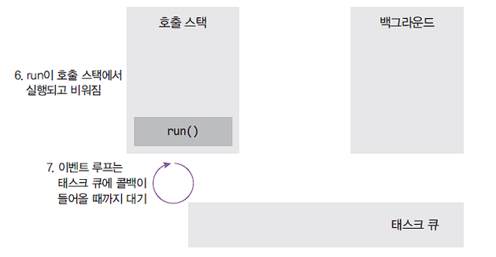

# 2. 호출스택, 이벤트 루프

# 2.1 호출스택(함수의 호출, 자료구조의 스택)

> 출처: Node.js 교과서

- Anonymous은 가상의 전역 컨텍스트(항상 있다고 생각하는 게 좋음)
- 함수 호출 순서대로 쌓이고, 역순으로 실행됨
- 함수 실행이 완료되면 스택에서 빠짐
- LIFO(Last In First Out) 구조라서 스택이라고 불림

# 2.2 이벤트 루프

> 출처: Node.js 교과서

이벤트 루프 구조

- 이벤트 루프: 이벤트 발생(setTimeout 등) 시 호출할 콜백 함수들(위의 예제에서는 run)을 관리하고, 호출할 순서를 결정하는 역할
- 태스크 큐: 이벤트 발생 후 호출되어야 할 콜백 함수들이 순서대로 기다리는 공간
- 백그라운드: 타이머나 I/O 작업 콜백, 이벤트 리스너들이 대기하는 공간. 여러 작업이 동시에 실행될 수 있음

> 출처: Node.js 교과서

setTimeout이 호출될 때 콜백 함수 run은 백그라운드로

- 백그라운드에서 3초를 보냄
- 3초가 다 지난 후 백그라운드에서 태스크 큐로 보내짐

setTimeout과 anonymous가 실행 완료된 후 호출 스택이 완전히 비워지면,  
이벤트 루프가 태스크 큐의 콜백을 호출 스택으로 올림

- 호출 스택이 비워져야만 올림
- 호출 스택에 함수가 많이 차 있으면 그것들을 처리하느라 3초가 지난 후에도 run 함수가 태스크 큐에서 대기하게 됨 → 타이머가 정확하지 않을 수 있는 이유

> 출처: Node.js 교과서

run이 호출 스택에서 실행되고, 완료 후 호출 스택에서 나감

- 이벤트 루프는 태스크 큐에 다음 함수가 들어올 때까지 계속 대기
- 태스크 큐는 실제로 여러 개고, 태스크 큐들과 함수들 간의 순서를 이벤트 루프가 결정함

