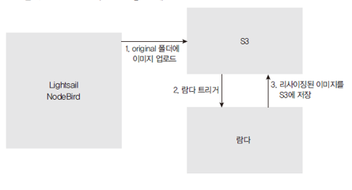
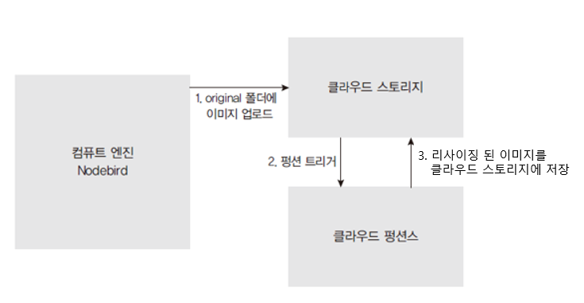

# 서버리스  
[1 서버리스](#1-서버리스)  
[-- 1.1 서버리스 컴퓨팅 이해하기](#11-서버리스-컴퓨팅-이해하기)  
[-- 1.1.1 서버리스(serverless, server+less)](#111-서버리스serverless-serverless)  
[2 AWS Lambda 사용하기](#2-aws-lambda-사용하기)  
[3 Google Cloud Functions 사용하기](#3-google-cloud-functions-사용하기)  

# 1 서버리스

## 1.1 서버리스 컴퓨팅 이해하기

### 1.1.1 서버리스(serverless, server+less)

- 서버가 없다는 뜻이지만 서버가 없는 것은 아니고, 서버를 직접 운영하지 않아도 된다는 뜻
개발자는 자신의 서비스 로직 작성에만 집중할 수 있음
- 단순히 코드를 업로드한 뒤, 사용량에 따라 요금을 지불하면 됨(함수처럼 호출할 때만 실행됨, FaaS(Function as a Service))
- 24시간 작동할 필요가 없는 서버인 경우, 서버리스 컴퓨팅을 사용하면 요금 절약
- AWS는 Lambda, GCP에서는 Cloud Functions나 Firebase가 유명함
- 이를 활용해 업로드하는 이미지를 리사이징 및 저장 가능
- `AWS S3 (Amazon Simple Storage Service)`와 `GCP (Google Cloud Platform)`은  
클라우드 기반의 스토리지 서비스입니다. 두 서비스는 각각 Amazon과 Google이 제공하는 클라우드 컴퓨팅 플랫폼 중 하나임

# 2 AWS Lambda 사용하기

## 1.2 이미지 리사이징을 위해 람다 사용

### 1.2.1 이미지 리사이징은 CPU를 많이 사용하기 때문에 기존 서버로 작업하면 무리가 감

- Lambda라는 기능을 사용해 필요할 때만 서버를 실행해서 리사이징

# 3 Google Cloud Functions 사용하기

## 3.1 이미지 리사이징을 위해 펑션 사용

### 이미지 리사이징은 CPU를 많이 사용하기 때문에 기존 서버로 작업하면 무리가 감

- Cloud Functions라는 기능을 사용해 필요할 때만 서버를 실행해서 리사이징

