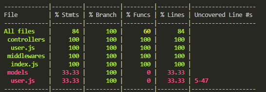

# 노드 서비스 테스트하기  
[1 테스트 준비하기](#1-테스트-준비하기)  
[-- 1.1 테스트를 하는 이유](#11-테스트를-하는-이유)  
[-- 1.2 jest 사용법](#12-jest-사용법)  
[2 테스트 커버리지](#2-테스트-커버리지)  
[-- 2.1 테스트 커버리지란?](#21-테스트-커버리지란)  
[-- 2.2 테스트 커버리지 주의점](#22-테스트-커버리지-주의점)  
[3 부하 테스트](#3-부하-테스트)  
[-- 3.1 부하 테스트란?](#31-부하-테스트란)  

# 1 테스트 준비하기

## 1.1 테스트를 하는 이유

### 자신이 만든 서비스가 제대로 동작하는지 테스트해야 함

- 기능이 많다면 수작업으로 테스트하기 힘듦
- 프로그램이 프로그램을 테스트할 수 있도록 자동화함
- 테스트 환경을 최대한 실제 환경과 비슷하게 흉내냄
- 아무리 철저하게 테스트해도 에러를 완전히 막을 수는 없음

### 테스트를 하면 좋은 점

- 허무한 에러로 인해 프로그램이 고장나는 것은 막을 수 있음
- 한 번 발생한 에러는 테스트로 만들어두면 같은 에러가 발생하지 않게 막을 수 있음
- 코드를 수정할 때 프로그램이 자동으로 어떤 부분이 고장나는 지 알려줌

## 1.2 jest 사용법

노드에서 테스트는 주로 `jest` 를 사용한다.

### 콘솔로 설치

```bash
npm i -D jest
```

### `package.json` 의 scripts 부분에 test 명령어 등록

```bash
"scripts": {
  "start": "nodemon app",
  "test": "jest"
},
```

### 테스트용 파일 작성후 실행

테스트용 파일은 파일명과 확장자 사이에 `test`나 `spec` 을 넣는다  

`npm test` 로 테스트 코드 실행 ⇒ 파일명에 `test`나 `spec` 이 들어간 파일들을 모두 찾아 실행함  

# 2 테스트 커버리지

## 2.1 테스트 커버리지란?

### 전체 코드 중에서 테스트 되고 있는 코드의 비율

- 테스트 되지 않는 코드의 위치도 알려줌
- jest –coverage
- Stmts: 구문
- Branch: 분기점
- Funcs: 함수
- Lines: 줄 수



## 2.2 테스트 커버리지 주의점

### 모든 코드가 테스트되지 않는데도 커버리지가 100%임

- 테스트 커버리지를 맹신할 필요가 없음
- 커버리지를 높이는 것이 의미는 있지만 높이는 데 너무 집착할 필요는 없음
- 필요한 부분 위주로 올바르게 테스트하는 것이 좋음

# 3 부하 테스트

## 3.1 부하 테스트란?

- 서버가 얼마만큼의 요청을 견딜 수 있는지 테스트
- 서버가 몇 명의 동시 접속자를 수용할 수 있는지 예측하기 매우 어려움
- 실제 서비스 중이 아니라 개발 중일 때는 더 어려움
- 코드에 문제가 없더라도 서버 하드웨어 때문에 서비스가 중단될 수 있음(메모리 부족 문제 등)
- 부하 테스트를 통해 미리 예측할 수 있음