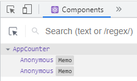

# 3. 컴포넌트
[컴포넌트란?](#3-컴포넌트)  
[3.1 컴포넌트의 종류](#31-컴포넌트의-종류)  
[--3.1.1 클래스 컴포넌트](#311-클래스-컴포넌트)  
[--3.1.2 함수형 컴포넌트 (권장)](#312-함수형-컴포넌트-권장)  
[3.2 props](#32-props)  
[--3.2.1 간단한 props 사용법](#321-간단한-props-사용법)  
[--3.2.2 태그 사이의 내용을 보여주는 props .children](#322-태그-사이의-내용을-보여주는-props-children)  
[3.3 useState](#33-usestate)  
[--3.3.1 useState 사용법](#331-usestate-사용법)  
[--3.3.2 setState 비동기](#332-setstate-비동기)  

**컴포넌트**  

- 재사용 가능한 HTML(UI) 조각단위

### 리액트 컴포넌트의 구성

render, state, props 로 구성되어 있다.  

- State: 내부 상태
- Props: 외부로부터 전달 받은 상태
- render: 나타내는 역할

# 3.1 컴포넌트의 종류

## 3.1.1 클래스 컴포넌트

- React 오리지널 컴포넌트
- class 형태로 정의하는 컴포넌트.
- 함수형 컴포넌트보다 구문이 복잡하고 길다.  
함수형 컴포넌트보다 구문이 좀 더 명확하다.

## 3.1.2 함수형 컴포넌트 (권장)

- 클래스 컴포넌트보다 구문이 간결하지만 그만큼 더 난해할 수 있다.
- 리액트 버전 16이후에 LifeCycle을 처리할 수 있는 hook이라는 기능이 도입되면서  
**React에서 공식적으로 권장**하는 컴포넌트 작성 방법

### App.js

```jsx
// (3-1) 직접 작성한 컴포넌트 참조
import Hello from './MyComponent1';
import World from './MyComponent2';

/** App이라는 이름의 함수형 컴포넌트(재사용 가능한 HTML 조각단위) 정의 */
// 프로젝트에서 컴포넌트를 렌더링(화면에 출력)하면 함수에서 반환하고 있는 내용이 브라우저에 나타난다.
function App() {
  return (
    <div>
      <h1>Hello React</h1>

      {/* (3-2) Hello World라는 이름의 컴포넌트 출력 */}
      <Hello></Hello> {/* 반드시 태그 끝에 `/`또는 끝태그가 있어야함 */}
      <World />
    </div>
  );
}

export default App;
```

### MyComponent1.js

```jsx
import MySubComponent from './MySubComponent';

/**
 * 함수형 컴포넌트 정의
 * - 함수 이름은 혼선을 방지하기 위해 소스파일 이름과 동일하게 구성하는 것이 일반적.
 */
const MyComponent1 = () => {
    return (
        <div>
            <h2>안녕하세요 리액트</h2>
            <p>리액트 컴포넌트 구조 연습입니다.</p>

            <MySubComponent />
            <MySubComponent />
            <MySubComponent />
        </div>
    );
};

export default MyComponent1;
```

### MySubComponent.js

```jsx
const MySubComponent = () => {
    return (
        <div>
            <ul>
                <li>item1</li>
                <li>item2</li>
                <li>item3</li>
            </ul>
        </div>
    );
};

export default MySubComponent;
```

# 3.2 props

properties 줄임말.  컴포넌트 속성을 설정할 때 사용.  

자식 컴포넌트가 부모 컴포넌트로부터 전달 받는 값이 포함되어 있는 객체.  

## 3.2.1 간단한 props 사용법

### props 를 전달 하는 부모 컴포넌트

컴포넌트에게 props 전달하기 - 문자열 값은 따옴표로 감싼다. 그 외의 형식은 `{}`로 감싼다.  

```jsx
import React from "react";
import MyPropsSub from "../components/MyPropsSub";

const MyProps = () => {

    console.clear();

    return (
        <div>
            <h2>MyProps</h2>

            {/* 컴포넌트에게 props 전달하기 - 문자열 값은 따옴표로 감싼다. 그 외의 형식은 {}로 감싼다. */}
            <MyPropsSub />
            <MyPropsSub name='민호' age='19' />
            <MyPropsSub name='수영' age={21} />
        </div>
    );
}   

export default MyProps;
```

### props 를 전달 받는 자식 컴포넌트

 `name` 값을 조회하고 싶다면 `props.name` 을 조회하면 된다.  

```jsx
import React from "react";

const MyPropsSub = (props) => {

    console.group("MyPropsSub");
    console.log(props);
    console.log(typeof props.name);
    console.log(typeof props.age);
    console.groupEnd();

    return (
        <div>
            <h3>MyPropsSub</h3>
            <p>
                제 이름은 <b>{props.name}</b>이고 나이는 <b>{props.age}</b>입니다.
            </p>
        </div>
    );
}   

// 속성값이 전달되지 않을 경우에 대비하여 기본값을 JSON으로 정의해 둘 수 있다.
// (defaultProps 객체이름 고정)
// 가급적 권장
MyPropsSub.defaultProps = {
    name: '이름없음',
    age: 20
};

export default MyPropsSub;
```

### 구조분해(=비구조화) 할당을 통해 자식 컴포넌트를 아래와 같이 수정 가능

```jsx
import React from "react";

// 여기가 수정됨
const MyPropsSub = ({ name, age }) => {

    return (
        <div>
            <h3>MyPropsSub</h3>
            <p>
                제 이름은 <b>{name}</b>이고 나이는 <b>{age}</b>입니다.
            </p>
        </div>
    );
}   

MyPropsSub.defaultProps = {
    name: '이름없음',
    age: 20
};

export default MyPropsSub;
```

## 3.2.2 태그 사이의 내용을 보여주는 props .children

컴포넌트를 사용할 때 태그 사이의 내용을 보여줌

### 부모 컴포넌트

```jsx
import React from "react";
import MyChildrenSub from "../components/MyChildrenSub";

const MyChildren = () => {
    return (
        <div>
            <h2>MyChildren</h2>

            <MyChildrenSub width={400} height={100}><b>Hello World</b></MyChildrenSub>   
        </div>
    );
}   

export default MyChildren;
```

### 자식 컴포넌트

```jsx
import React from "react";

import PropTypes from 'prop-types';

const MyChildrenSub = ({width, height, children}) => {
    /** CSS 속성값을 변수화 할 경우 JSON 객체로 구성한다. */
    const myStyle = {
        // 부모로부터 전달받은 props에 포함된 값으로 width, height 결정
        width: width + 'px',
        height: height + 'px',
        border: '5px solid #d5d5d5',
        padding: '20px',
        margin: '10px',
        backgroundColor: '#eeeeee',
    };

    return (
        <div>
            <h3>MyChildrenSub</h3>
            {/* 부모 컴포넌트가 자신을 호출할 때 시작태그와 끝내그 사이에 명시하는 내용이 children이다. innerHTML 느낌*/}
            <div style={myStyle}>{children}</div>
        </div>
    );
}  

export default MyChildrenSub;
```

# 3.3 useState
## 3.3.1 useState 사용법
- 함수형 컴포넌트에서 state값 생성
- 하나의 useState 함수는 하나의 상태값만 관리할 수 있다.
- 컴포넌트에서 관리해야 할 상태가 여러 개면 useState를 여러번 사용

> 상태변수: 현재 state 변수  
변수에대한setter함수: 상태변수를 갱신할 수 있는 함수  
useState: 리액트 Hook  
useState(변수의기본값)의 넘겨주는 값 : 초기값

useState() 함수를 import하고 사용하는 경우.  

```jsx
import React, {useState} from 'react';
	...
const [상태변수, 변수에대한setter함수] = useState(변수의기본값);
```

useState() 함수를 import하지 않고 직접 사용하는 경우.  

```jsx
const [상태변수, 변수에대한setter함수] = React.useState(변수의기본값);
```

리액트는 상태값state, props 가 바꼈을 때 렌더링 된다.  
또는 부모 컴포넌트가 리렌더링 되면 자식 컴포넌트도 리렌더링 된다.  
⇒ memo 를 사용하면 부모 컴포넌트가 리렌더링 되었을 때 자식 컴포넌트가 리렌더링 되는 것을  방지할 수 있다.  (memo를 사용하면 개발자도구에 컴포넌트 이름이 이상하게 나오는데 `.displayName` 을 사용해서 컴포넌트 이름을 다시 조정해주면 해결 가능하다.)

- memo 사용



- memo 사용후  `.displayName` 적용: 
 `Counter.displayName = 'Counter';`


### lazy init

초기값에 함수가 들어가면 함수의 리턴값이 들어간다.  

함수가 호출되어 리턴값을 돌려줄 때까지 리액트가 기다려줌.  

react 공식문서에서는 이것을 초기 값이 복잡한 연산을 포함할 때 사용하라고 되어 있다.  
이것은 **오직 state가 처음 만들어 질 때만 실행된다.**  
이 후에 다시 리렌더링이 된다면, 이 함수의 실행은 무시된다.  

```jsx
const [num, setNum] = useState(getNum);
```

## 3.3.2 setState 비동기  
### setState는 비동기로 동작한다.

과거 state값을 이용해서 setState 하려면 함수형으로 업데이트 해줘야 한다.  

- 하나는 숫자를 1씩 증가시키는 버튼이고, 하나는 숫자를 1씩 감소시키는 버튼

```jsx
import React, { useState } from "react"

function App() {

  const [num, setNum] = useState(1)

  async function plus() {
    setNum(num + 1)
  }

  async function minus() {
    setNum(num - 1)
  }

  return (
    <div className="App">
      <h1>{num}</h1>
      <button onClick={plus}>PLUS</button>
      <button onClick={minus}>MINUS</button>
    </div>
  );
}

export default App;
```

- 1씩 증가하던것을 3씩 증가시키기 위해 아래처럼 변경하려고 아래와 같이 변경

```jsx
import React, { useState } from "react"

function App() {

  const [num, setNum] = useState(1)

  async function plus() {
    setNum(num + 1)
    setNum(num + 1)
    setNum(num + 1)
  }

  async function minus() {
    setNum(num - 1)
  }

  return (
    <div className="App">
      <h1>{num}</h1>
      <button onClick={plus}>PLUS</button>
      <button onClick={minus}>MINUS</button>
    </div>
  );
}

export default App;
```

같은 state를 연속으로 업데이트(setState를 연속 호출) 하려고 하면 리액트는 불필요한 렌더링을 줄이기 위해서 setState를 동기로 수행하지 않고, 배치batch 처리하여 state 업데이트를 한 번에 리렌더링 한다.  
React 의 batch 시스템: React는 16ms 동안 변경된 상태값들을 하나로 묶는다. (16ms 단위로 배치를 진행한다.)  

- 이를 해결하기 위해 setState 가 이전 state와 함께 함수를 전달 받으면 된다.

```jsx
import React, { useState } from "react"

function App() {

  const [num, setNum] = useState(1)

  async function plus() {
    setNum(num => num + 1)
    setNum(num => num + 1)
    setNum(num => num + 1)
  }

  async function minus() {
    setNum(num - 1)
  }

  return (
    <div className="App">
      <h1>{num}</h1>
      <button onClick={plus}>PLUS</button>
      <button onClick={minus}>MINUS</button>
    </div>
  );
}

export default App;
```

- 부모로부터 받은 props 를 자식컴포넌트에서 바꾸고 싶을 때 props 를 useState 의 초기값에 넣어주고 setState 로 변경해줄 수 있다.  
props는 직접 바꾸는 게 아니라 state 를 통해서 바꿔줘야 한다. ⇒ 부모에 영향을 미치면 안 되기 때문. (좋은 구조는 아닌데 쓰는 경우가 있다고 함.)