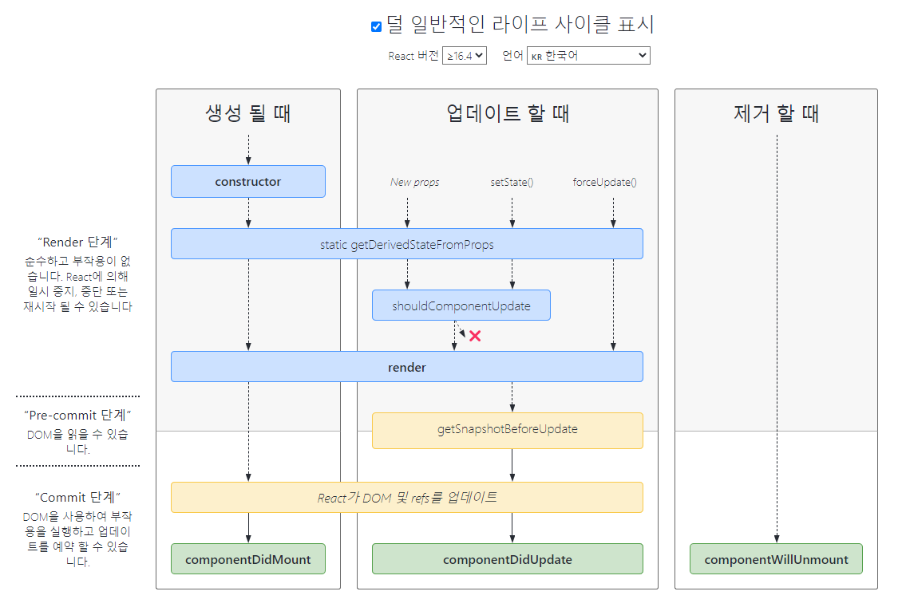
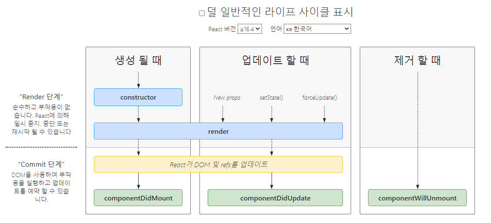

# 7. 라이프 사이클 메서드  
[7.1 라이프사이클 메서드의 이해](#71-라이프사이클-메서드의-이해)  
[7.1.1 마운트(mounting)](#711-마운트mounting)  
[-- constructor](#constructor)  
[-- getDerivedStateFromProps](#getderivedstatefromprops)  
[-- render](#render)  
[-- componentDidMount](#componentdidmount)  
[7.1.2 업데이트(updating)](#712-업데이트updating)  
[-- getDerivedStateFromProps](#getderivedstatefromprops-1)  
[-- shouldComponentUpdate](#shouldcomponentupdate)  
[-- render](#render-1)  
[-- getSnapshotBeforeUpdate](#getsnapshotbeforeupdate)  
[-- componentDidUpdate](#componentdidupdate)  
[7.1.3 언마운트(unmounting)](#713-언마운트unmounting)  
[-- componentWillUnmount](#componentwillunmount)  
[7.2 에러 처리 componentDidCatch](#72-에러-처리-componentdidcatch)  
[정리 및 라이프사이클 사진](#정리-및-라이프사이클-사진)  

모든 리액트 컴포넌트에는 라이프사이클(생명주기)이 존재함  
컴포넌트의 수명은 페이지에 렌더링되기 전인 준비 과정에서 시작하여 페이지에서 사라질  끝남  

> 라이프사이클(****Lifecycle****): 소프트웨어 개발에서 Lifecycle은 어떤 프로그램이 실행되고 종료되는 과정을 의미
> 
`Will` 접두사가 붙은 메서드는 어떤 작업을 작동하기 `전`에 실행되는 메서드  
`DId` 접두사가 붙은 메서드는 어떤 작업을 작동한 `후`에 실행되는 메서드  
이 메서드들은 컴포넌트 클래스에서 덮어 써 선언함으로써 사용할 수 있음  

**라이프사이클 메서드**는 **클래스형 컴포넌트**에서만 사용 가능하다  
**함수 컴포넌트**에서는 사용할 수 없다. 대신 **Hooks 기능을 사용**하여 비슷한 작업을 처리할 수 있다  

> react Hooks 의 `useEffect` 를 사용(작동 방식은 많이 다름)
> 

- 라이프사이클을 정리한 사진



> 출처: [https://projects.wojtekmaj.pl/react-lifecycle-methods-diagram/](https://projects.wojtekmaj.pl/react-lifecycle-methods-diagram/)
> 

# 7.1 라이프사이클 메서드의 이해

라이프사이클은 총 세가지, 마운트, 업데이트, 언마운트 로 나눔  

> 컴포넌트는 ‘**생성**(mounting) -> **업데이트**(updating) -> **제거**(unmounting)’ 의 생명주기를 가짐
> 
- 마운트: 페이지에 컴포넌트가 나타남
- 업데이트: 리렌더링-컴포넌트 정보를 업데이트
- 언마운트: 페이지에서 컴포넌트가 사라짐

## 7.1.1 마운트(mounting)

DOM이 생성되고 웹 브라우저상에서 나타나는 것  

- 아래는 마운트할 때 호출하는 메서드이다  
**컴포넌트 만들기** → **constructor** → **getDerivedStateFromProps** → **render** → **componentDidMount**

### constructor

**컴포넌트를 새로 만들 때마다 호출되는 클래스 생성자 메서드**  

초기 state를 정할 수 있음  

```jsx
  constructor(props) {
    super(props);
    console.log("constructor");
  }
```

### getDerivedStateFromProps

**props에 있는 값을 state에 넣을 때 사용하는 메서드**  

앞에 `static` 을 필요로 하고, 이 안에서는 `this` 롤 조회 할 수 없다  

여기서 특정 객체를 반환하게 되면 해당 객체 안에 있는 내용들이 컴포넌트의 `state` 로 설정이 됨. 반면 `null` 을 반환하게 되면 아무 일도 발생하지 않음  

```jsx
  static getDerivedStateFromProps(nextProps, prevState) {
    console.log("getDerivedStateFromProps");
    if (nextProps.color !== prevState.color) { // 조건에 따라 특정 값 동기화
      return { color: nextProps.color };
    }
    return null; // state를 변경할 필요가 없다면 null을 반환
  }
```

### render

**우리가 준비한 UI를 렌더링하는 메서드**  

`this.props`, `this.stete` 에 접근 가능, 리액트 요소 반환  
요소는 태그, 컴포넌트 다양하게 될 수 있음  
아무것도 보여 주고 싶지 않다면 null, false 값을 반환  

이벤트 설정이 아닌 곳에서 setState를 사용하면 안 됨(render 안에는 setState 가 들어가면 안 된다. ⇒ 무한 렌더링 발생)  
브라우저의 DOM에 접근해서도 안 됨  
DOM 정보를 가져오거나 state에 변화를 줄 때는 `componentDidUpdate` 에서 처리

### componentDidMount

**컴포넌트가 웹 브라우저상에 나타난 후 호출하는 메서드**

컴포넌트의 첫번째 렌더링을 마치고 나면 호출  
(이 메서드가 호출되는 시점에는 우리가 만든 컴포넌트가 화면에 나타난 상태)  

이벤트 등록, setTimeout, setInterval 작업 처리  
DOM 을 사용해야하는 외부 라이브러리 연동,  
네트워크 요철 같은 비동기 작업 처리(해당 컴포넌트에서 필요로하는 데이터를 요청하기 위해 axios, fetch 등을 통하여 ajax 요청)  

```jsx
componentDidMount() {
	// ...
}
```

## 7.1.2 업데이트(updating)

컴포넌트는 아래와 같은 총 네 가지 경우에 업데이트함  

1. props가 바뀔 때
2. state가 바뀔 때
3. 부모 컴포넌트가 리렌더링될 때
4. this.forceUpdate로 강제로 렌더링을 트리거할 때
- 컴포넌트를 업데이트할 때 호출하는 메서드  
**업데이트를 발생시키는 요인**(props 변경, state 변경, 부모 컴포넌트 리렌더링) → **getDerivedStateFromProps** → **shouldComponentUpdate** —(true반환 시 render 호출, false 반환 시 여기서 작업 취소)→ **render**(forceUpdate) **→ getSnapshotBeforeUpdate** → **componentDidUpdate**

### getDerivedStateFromProps

이 메서드는 마운트 과정에서도 호출됨  

업데이트가 시작하기 전에도 호출됨  

props의 변화에 따라 state 값에도 변화를 주고 싶을 때 사용함  

### shouldComponentUpdate

**컴포넌트가 리렌더링을 해야 할지 말아야 할지를 결정하는 메서드**  

이 메서드에서 현재 props와 state는 `this.props`와 `this.state`로 접근하고, 새로 설정될 `props, state`는 `nextProps, nextState` 로 접근함  

이 메서드는 true 혹은 false 값을 반환해야 함
true를 반환하면 다음 라이프사이클 메서드를 계속 실행  
false를 반환하면 작업을 중지(컴포넌트가 리렌더링되지 않음)  

특정 함수에서 this.forceUpdate() 함수를 호출하면 이 과정을 생략하고 바로 render 함수 호출  

주로 최적화 할 때 사용하는 메서드 `React.memo` 의 역할과 비슷함  

```jsx
shouldComponentUpdate(nextProps, nextState) {
    console.log("shouldComponentUpdate", nextProps, nextState);
    // 숫자의 마지막 자리가 4면 리렌더링하지 않습니다
    return nextState.number % 10 !== 4;
  }
```

### render

**컴포넌트를 리렌더링 함**  

### getSnapshotBeforeUpdate

컴포넌트 변화를 DOM에 반영하기 바로 직전에 호출하는 메서드  
(render 에서 만들어진 결과물이 브라우저에 실제로 반영되기 직전에 호출)  

이 메서드에서 반환하는 값은 componentDidUpdate 에서 세 번째 파라미터인 snapshot 값으로 전달 받을 수 있음  

주로 업데이트하기 직전의 값을 참고할 일이 있을 때 활용(스크롤바 위치 유치)  

```jsx
  getSnapshotBeforeUpdate(prevProps, prevState) {
    console.log("getSnapshotBeforeUpdate");
    if (prevProps.color !== this.props.color) {
      return this.myRef.style.color;
    }
    return null;
  }
```

### componentDidUpdate

컴포넌트의 업데이트 작업이 끝난 후 호출하는 메서드  
(리렌더링이 마치고, 화면에 우리가 원하는 변화가 모두 반영되고 난 뒤 호출되는 메서드)  

3번째 파라미터로 `getSnapshotBeforeUpdate` 에서 반환한 값을 조회 할 수 있음  

```jsx
  componentDidUpdate(prevProps, prevState, snapshot) {
    console.log("componentDidUpdate", prevProps, prevState);
    if (snapshot) {
      console.log("업데이트 되기 직전 색상: ", snapshot);
    }
  }
```

## 7.1.3 언마운트(unmounting)

마운트의 반대 과정, 컴포넌트가 화면에서 사라지는것을 의미함  
컴포넌트를 DOM에서 제거하는 것  

- 언마운트할 때 호출하는 메서드  
**언마운트하기** → **componentWillUnmount**

### componentWillUnmount

컴포넌트가 웹 브라우저상에서 사라지기 전에 호출하는 메서드  

DOM에 직접 등록했었던 이벤트, DOM을 제거  
이후에 **컴포넌트는 다시 렌더링 되지 않으므로, 여기에서 setState()를 호출하면 안됨**  

만약에 `setTimeout` 을 걸은것이 있다면 `clearTimeout` 을 통하여 제거  

추가적으로, 외부 라이브러리를 사용한게 있고 해당 라이브러리에 dispose 기능이 있다면 여기서 호출  

```jsx
  componentWillUnmount() {
    console.log("componentWillUnmount");
  }
```

# 7.2 에러 처리 ****componentDidCatch****

컴포넌트 렌더링 도중에 에러가 발생했을 때 애플리케이션에서 발생하는 에러를 처리  

`error`: 파라미터에 어떤 에러가 발생했는지 알려 줌  
`info`: 어디에 있는 코드에서 오류가 발생했는지에 대한 정보를 줌  

단, 컴포넌트 자신에게 발생하는 에러는 잡아낼 수 없고,  
자신의 `this.props.children` 으로 전달되는 컴포넌트에서 발생하는 에러만 잡아낼 수 있음  

```jsx
 componentDidCatch(error, info) {
    this.setState({
      error: true
    });
    console.log('에러가 발생했습니다.');
    console.log({ error, info });
  }
```

# 정리 및 라이프사이클 사진

클래스의 경우 -> constructor -> render -> ref -> componentDidMount  

(setState/props 바뀔때) -> shouldComponentUpdate(true) -> render -> componentDidUpdate  

부모가 나를 없앴을 때 -> componentWillUnmount -> 소멸  

- 라이프 사이클 사진1


> 출처: [https://projects.wojtekmaj.pl/react-lifecycle-methods-diagram/](https://projects.wojtekmaj.pl/react-lifecycle-methods-diagram/)
> 
- 라이프 사이클 사진2



> 출처: [https://projects.wojtekmaj.pl/react-lifecycle-methods-diagram/](https://projects.wojtekmaj.pl/react-lifecycle-methods-diagram/)
> 
