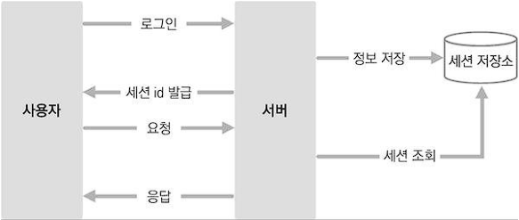
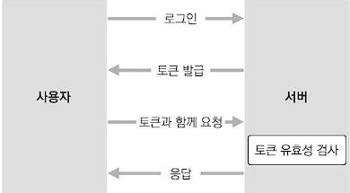

# JWT  
[.1 JWT란?](#1-jwt란)  
[.2 세션 기반 인증과 토큰 기반 인증의 차이](#2-세션-기반-인증과-토큰-기반-인증의-차이)  
[-- .2.1 세션 기반 인증 시스템](#21-세션-기반-인증-시스템)  
[-- .2.2 토큰 기반 인증 시스템](#22-토큰-기반-인증-시스템)  

# .1 JWT란?

JWT는 JSON Web Token의 약자로, 데이터가 JSON으로 이루어져 있는 토큰을 의미한다  

두 개체가 서로 안전하게 정보를 주고받을 수 있도록 웹 표준으로 정의된 기술  

# .2 세션 기반 인증과 토큰 기반 인증의 차이

세션을 기반으로 인증과 토큰을 기반으로 인증 두 방법은  
사용자의 로그인 상태를 서버에서 처리하는 데 사용할 수 있는 대표적인 두 가지 인증 방식   

## .2.1 세션 기반 인증 시스템

세션을 기반으로 인증 시스템을 만든다는 것은  
서버가 사용자가 로그인 중임을 기억한다는 뜻  

  

세션 기반 인증 시스템에서 사용자가 로그인을 하면, 서버는 세션 저장소에 사용자의 정보를 조회하고 세션 id를 발급  

발급된 id는 주로 브라우저의 쿠키에 저장  

그다음에 사용자가 다른 요청을 보낼 때마다 서버는 세션 저장소에서 세션을 조회한 후 로그인 여부를 결정하여 작업을 처리하고 응답  

세션 저장소는 주로 메모리, 디스크, 데이터베이스 등을 사용  

세션 기반 인증의 단점은 서버를 확장하기가 번거로워질 수 있다는 점  

만약 서버의 인스턴스가 여러 개가 된다면, 모든 서버끼리 같은 세션을 공유해야 하므로 세션 전용 데이터베이스를 만들어야 할 뿐 아니라 신경 써야 할 것도 많다  

## 2.2 토큰 기반 인증 시스템

토큰은 로그인 이후 서버가 만들어 주는 문자열  

해당 문자열 안에는 사용자의 로그인 정보가 들어 있고, 해당 정보가 서버에서 발급되었음을 증명하는 서명이 들어 있다  

서명 데이터는 해싱 알고리즘을 통해 만들어진다  

> JWT는 세 가지 부분으로 이루어져 있다.  
첫 번째 부분은 토큰의 유형을 지정하는 헤더(Header).  
두 번째 부분은 클레임 정보를 담고 있는 페이로드(Payload).  
세 번째 부분은 서명(Signature). 이 서명은 헤더와 페이로드를 조합한 후, 특정 비밀키를 사용하여 생성된다.  

  

서버에서 만들어 준 토큰은 서명이 있기 때문에 무결성이 보장된다  

> 무결성이란 정보가 변경되거나 위조되지 않았음을 의미하는 성질

사용자가 로그인을 하면 서버에서 사용자에게 해당 사용자의 정보를 지니고 있는 토큰을 발급해 주고, 추후 사용자가 다른 API를 요청하게 될 때 발급받은 토큰과 함께 요청하게 된다  

그러면 서버는 해당 토큰이 유효한지 검사하고, 결과에 따라 작업을 처리하고 응답  

토큰 기반 인증 시스템의 장점은 서버에서 사용자 로그인 정보를 기억하기 위해 사용하는 리소스가 적다는 것  

사용자 쪽에서 로그인 상태를 지닌 토큰을 가지고 있으므로 서버의 확장성이 매우 높다  

서버의 인스턴스가 여러 개로 늘어나도 서버끼리 사용자의 로그인 상태를 공유하고 있을 필요가 없다

# .3 JWT의 보안 취약점  
JWT의 보안 취약점은 여러 가지가 있다.  
대표적으로는 토큰 탈취, 토큰 변조, 토큰 재사용 등이 있다.  이러한 취약점을 방지하기 위해서는 토큰의 유효 기간을 짧게 설정하거나,  
HTTPS를 사용하여 통신하는 것 등이 있다.  